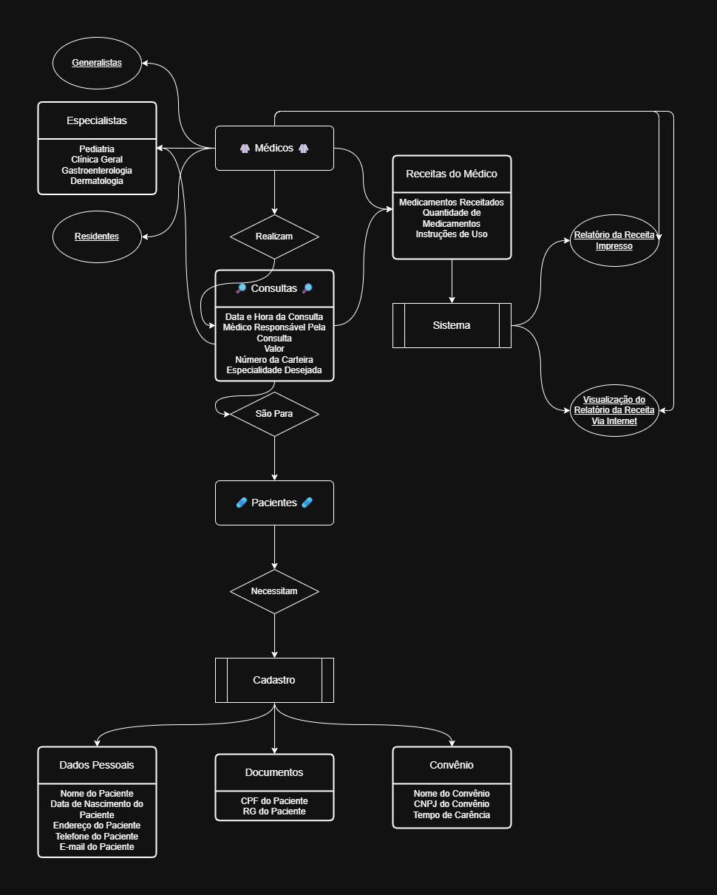
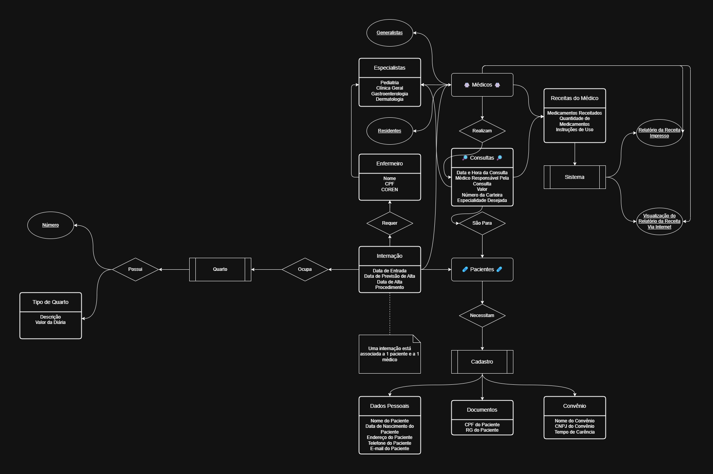
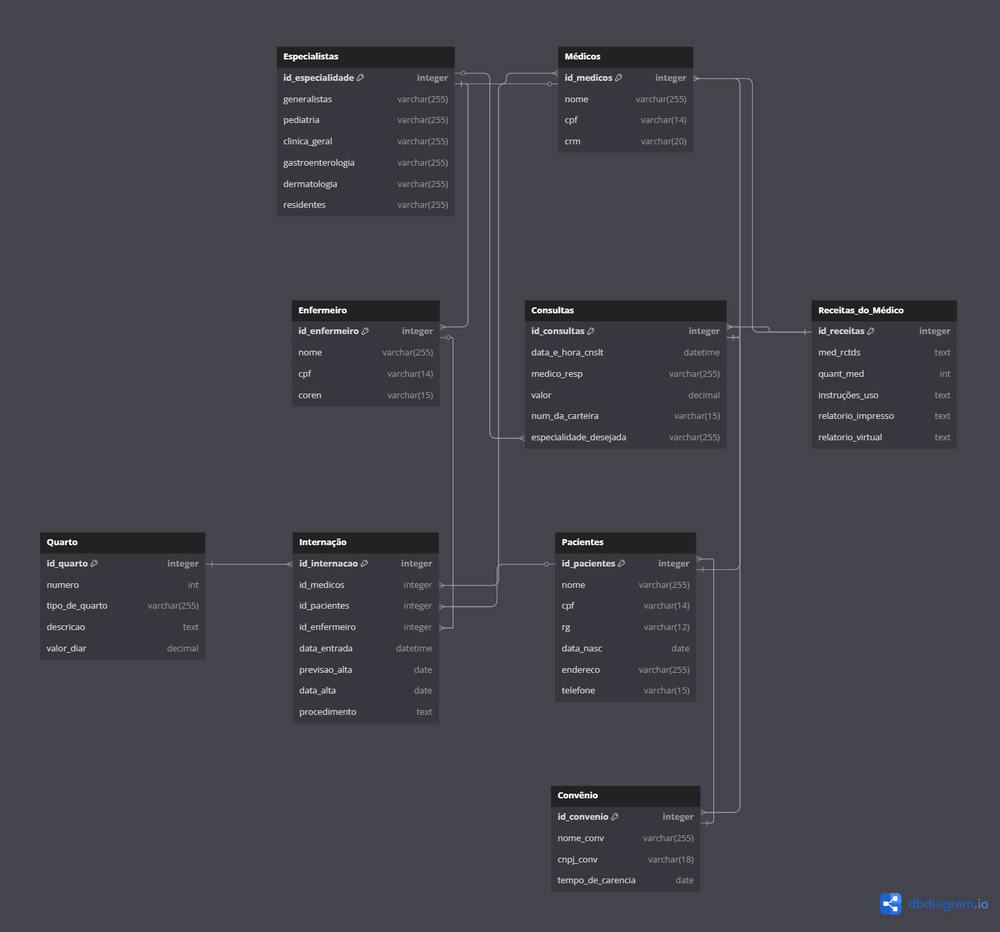

# 🏥 Criando um Banco de Dados para um Hospital

Um pequeno hospital local busca desenvolver um novo sistema para gerenciar suas operações, transferindo dados antigos armazenados em planilhas para um banco de dados estruturado. O objetivo é criar um **Diagrama Entidade-Relacionamento (DER)** adequado e expandir funcionalidades conforme necessário.

## ⚕️🌈🚑 PARTE 1 - O Hospital Fundamental - Modelagem Inicial

## 📌 Entidades Principais
- 🩹 `Pacientes`: Dados Pessoais, Documentos e Convênio Médico;
- 🥼 `Médicos`: Generalistas, Especialistas ou Residentes, podendo ter Múltiplas Especialidades (Como Clínicos Gerais, Dermatologistas, Gastroenterologistas e Pediatras);
- 🔎 `Consultas`: Registros de Atendimentos com Data, Médico Responsável, Paciente e Convênio.

---

---

## ⚕️🌈🚑 PARTE 2 - Os Segredos do Hospital - Expandindo o Banco de Dados

## 📌 Novos Requisitos
A segunda versão do sistema introduziu funcionalidades essenciais para o **Controle de Internações**, incluindo:
- 🗓️ `Internação`: Registro de Data de Entrada, Data de Previsão de Alta, Data de Alta e Procedimento;
- 🧑🏽‍⚕️ `Enfermeiro`: Controle dos Enfermeiros responsáveis pela internação, incluindo Nome, CPF e Registro no Conselho de Enfermagem (COREN ou CRE);
- 🛏️ `Quarto`: Vinculação da Internação a um Quarto específico, com Número e Tipo do Quarto (Com Descrição e Valor da Diária).

## 📌 Modificações no Modelo
- **Novas Entidades**: `Internação`, `Enfermeiro` e `Quarto`.

---

---

---

## 📋 Entidades (Em Tabelas)

### `Médicos`
Armazena os dados dos médicos.

| Campo       | Tipo          | Descrição                                      |
|------------|--------------|------------------------------------------------|
| id_medicos | integer [PK]  | Identificador único do médico                 |
| nome       | varchar(255)  | Nome completo do médico                       |
| cpf        | varchar(14)   | Cadastro de Pessoa Física (CPF) - único       |
| crm        | varchar(20)   | Registro do Conselho Regional de Medicina (CRM) |

### `Consultas`
Registra as consultas médicas realizadas.

| Campo               | Tipo           | Descrição                                    |
|---------------------|---------------|----------------------------------------------|
| id_consultas       | integer [PK]   | Identificador único da consulta             |
| data_e_hora_cnslt  | datetime       | Data e hora da consulta                     |
| medico_resp        | varchar(255)   | Nome do médico responsável pela consulta    |
| valor              | decimal        | Valor da consulta                           |
| num_da_carteira    | varchar(15)    | Número da carteirinha do plano de saúde     |
| especialidade_desejada | varchar(255) | Especialidade médica solicitada             |

### `Pacientes`
Registra os pacientes atendidos pelo hospital.

| Campo       | Tipo         | Descrição                                |
|------------|------------|------------------------------------------|
| id_pacientes | integer [PK] | Identificador único do paciente         |
| nome        | varchar(255) | Nome completo                           |
| cpf         | varchar(14)  | Cadastro de Pessoa Física (CPF) - único  |
| rg          | varchar(12)  | Registro Geral (RG)                     |
| data_nasc   | date        | Data de nascimento                      |
| endereco    | varchar(255)| Endereço do paciente                    |
| telefone    | varchar(15) | Telefone para contato                   |

### `Convênio`
Armazena os dados dos convênios aceitos pelo hospital.

| Campo          | Tipo          | Descrição                              |
|---------------|--------------|----------------------------------------|
| id_convenio   | integer [PK]  | Identificador único do convênio        |
| nome_conv     | varchar(255)  | Nome do convênio                       |
| cnpj_conv     | varchar(18)   | Cadastro Nacional da Pessoa Jurídica (CNPJ) |
| tempo_de_carencia | date      | Tempo de carência contratual           |

### `Especialistas`
Gerencia os diferentes especialistas médicos disponíveis.

| Campo             | Tipo           | Descrição                         |
|------------------|---------------|-----------------------------------|
| id_especialidade | integer [PK]   | Identificador único da especialidade |
| generalistas     | varchar(255)   | Médicos generalistas             |
| pediatria        | varchar(255)   | Especialistas em pediatria       |
| clinica_geral    | varchar(255)   | Especialistas em clínica geral   |
| gastroenterologia| varchar(255)   | Especialistas em gastroenterologia |
| dermatologia     | varchar(255)   | Especialistas em dermatologia    |
| residentes       | varchar(255)   | Médicos residentes               |

### `Receitas_do_Médico`
Armazena as receitas médicas emitidas pelos médicos.

| Campo              | Tipo          | Descrição                          |
|-------------------|--------------|-----------------------------------|
| id_receitas       | integer [PK]  | Identificador único da receita    |
| med_rctds         | text         | Medicamentos receitados           |
| quant_med         | int          | Quantidade prescrita              |
| instruções_uso    | text         | Orientações sobre uso dos medicamentos |
| relatorio_impresso | text        | Relatório impresso disponível     |
| relatorio_virtual | text         | Relatório digital disponível      |

## 👤 Novas Entidades!

### `Internação`
Gerencia as internações hospitalares.

| Campo         | Tipo          | Descrição                          |
|--------------|--------------|-----------------------------------|
| id_internacao | integer [PK]  | Identificador único da internação |
| id_medicos    | integer [FK]  | Médico responsável pela internação |
| id_pacientes  | integer [FK]  | Paciente internado                |
| id_enfermeiro | integer [FK]  | Enfermeiro responsável            |
| data_entrada  | datetime     | Data de entrada do paciente       |
| previsao_alta | date         | Data estimada de alta             |
| data_alta     | date         | Data real da alta                 |
| procedimento  | text         | Procedimento realizado            |

### `Enfermeiro`
Lista os enfermeiros envolvidos nas internações.

| Campo         | Tipo          | Descrição                          |
|--------------|--------------|-----------------------------------|
| id_enfermeiro| integer [PK]  | Identificador único do enfermeiro |
| nome         | varchar(255)  | Nome completo                     |
| cpf          | varchar(14)   | Cadastro de Pessoa Física (CPF) - único |
| coren        | varchar(15)   | Registro no Conselho Regional de Enfermagem (COREN) |

### `Quarto`
Registra os quartos disponíveis no hospital.

| Campo         | Tipo          | Descrição                          |
|--------------|--------------|-----------------------------------|
| id_quarto    | integer [PK]  | Identificador único do quarto     |
| numero       | int          | Número do quarto                  |
| tipo_de_quarto | varchar(255)| Categoria do quarto (apartamento, enfermaria) |
| descricao    | text         | Detalhes sobre o quarto           |
| valor_diar   | decimal      | Valor diário cobrado              |

---

## ⚕️🌈🚑 PARTE 3 - O Prisioneiro dos Dados - Alimentando o Banco de Dados

## 📌 Novos Requisitos
Nesta etapa, o sistema hospitalar recebe os primeiros dados inseridos, garantindo que todas as tabelas estejam corretamente preenchidas para a operação do hospital.

---

<h3 align="center">Em Desenvolvimento...</h3>

---

## 🛠 Tecnologias Usadas
- **DER**: [draw.io](https://www.drawio.com/)
- **Script SQL**: [dbdiagram.io](https://dbdiagram.io/)

---
