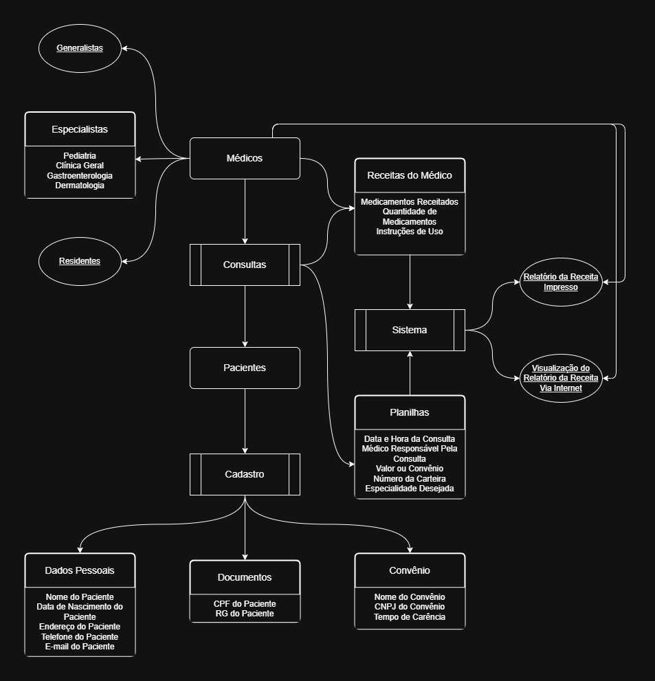

# 🏥 Criando um Banco de Dados para um Hospital

Um pequeno hospital local busca desenvolver um novo sistema para gerenciar suas operações, transferindo dados antigos armazenados em planilhas para um banco de dados estruturado. O objetivo é criar um **Diagrama Entidade-Relacionamento (DER)** adequado e expandir funcionalidades conforme necessário.

## ⚕️🌈 PARTE 1 - O Hospital Fundamental

## 📌 Entidades Principais
- 🩹 **Pacientes**: Dados pessoais, documentos e convênio médico.
- 🧑🏽‍⚕️ **Médicos**: Generalistas, especialistas ou residentes, podendo ter múltiplas especialidades.
- 🔎 **Consultas**: Registro de atendimentos com data, médico responsável, paciente e convênio.
---

---

## ⚕️🌈 PARTE 2 - Expansão do Sistema

Após a primeira versão, identificou-se a necessidade de novas funcionalidades, incluindo:

### 📌 Controle de Internações
- **Registro de pacientes internados**.
- **Histórico de internações**.
- **Gestão de quartos e leitos**.
- **Monitoramento de tratamento e evolução clínica**.

### 📌 Estrutura do Banco de Dados
- Expandir o **Modelo ER** para suportar novas funções.
- Criar **tabelas e testes iniciais** para validação.

---

<h3 align="center">Em Desenvolvimento...</h3>

---

## 🛠 Tecnologias Usadas
- **DER**: [draw.io](https://www.drawio.com/)

---
